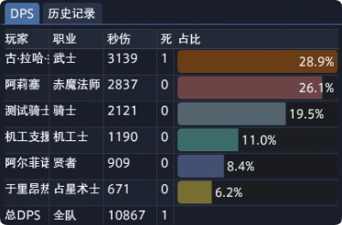
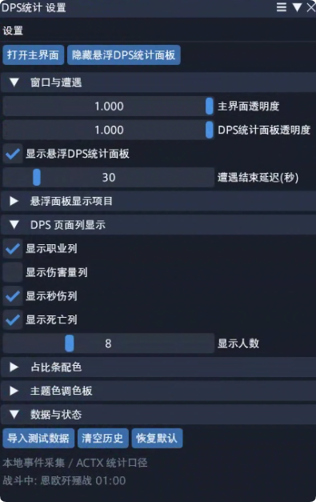

# DPS统计

最后更新：`2026-05-06`

`DPS统计` 是一个直接在游戏内显示战斗统计的 Dalamud 插件。

它的目标很直接：

- 不依赖外部 `ACT` 页面或额外悬浮网页
- 直接在游戏里看 `DPS / HPS / 承伤 / 历史记录`
- 只统计自己和当前队伍里的队友
- 支持点击历史记录回看那一场战斗的数据

## 界面预览





## 这是什么

当前版本的 `DPS统计` 已经不是早期那种依赖外部数据源的面板壳。

现在它的工作方式是：

- 直接在 Dalamud 内采集战斗事件
- 在插件内部生成统计结果
- 用中文界面显示到主窗口和悬浮面板里

换句话说，如果你只是想在游戏里简单看输出、承伤和历史记录，这个插件就是朝这个方向做的。

## 安装与启用

### 普通使用

如果你是正常使用插件的玩家：

1. 在你常用的 Dalamud 插件仓库里找到 `DPS统计`
2. 安装插件
3. 启用后，从游戏里的插件入口打开主窗口
4. 点击 `打开悬浮DPS统计面板`

### 本地测试

如果你是在本地编译和测试这个项目：

1. 构建项目
2. 使用生成出来的插件文件进行本地测试

当前构建产物位置：

- `E:\git\DalamudACT\output\DalamudACT.dll`

## Maintenance / 交接入口

- [HANDOVER.md](HANDOVER.md) ← 维护交接总入口
- [2026-05-06 Release Handoff](md/2026-05-06-RELEASE-HANDOFF.md)
- [Release Runbook](md/RELEASE-RUNBOOK.md)

### 第一次建议这样用

第一次打开后，推荐先这样设置：

- 先打开悬浮面板
- 先只保留 `DPS` 页
- 如果现在没有战斗，先用 `导入测试数据` 看效果
- 如果字太挤，再去设置里调整列宽、行高和透明度

## 当前功能

### 主要页面

- `DPS`
  查看队伍内每个人的伤害量、秒伤、死亡等信息
- `HPS`
  查看每秒治疗
- `承伤`
  查看每秒承受伤害
- `概览`
  查看整场战斗的总体信息
- `历史记录`
  查看之前保存的战斗记录，并点击回看

### 悬浮面板

- 可独立显示和隐藏
- 支持透明度调整
- `DPS` 页签左键可折叠 / 恢复
- `DPS` 页签右键可打开 / 关闭设置窗口

### DPS 页面

- 支持显示或隐藏以下列：
  - `职业`
  - `伤害量`
  - `秒伤`
  - `死亡`
- 表格底部会显示 `总DPS` 汇总行
- 伤害量使用中文单位显示，例如：
  - `9.68万`
  - `1.25亿`
  - `2.00兆`

### 历史记录

- 每场战斗会保存完整结果
- 每条历史记录会显示开始时间、结束时间和时长
- 支持导入 / 导出历史记录
- 点击历史记录中的某一条后：
  - 悬浮面板会切到那场战斗的数据
  - `DPS / HPS / 承伤 / 概览` 会一起切换
- 新的实时战斗开始后，会自动切回实时数据

### 测试数据

- 可一键导入测试数据
- 适合在没有进战时先检查界面排版和设置效果
- 导入测试数据不会清空已有历史记录

### 界面设置

- 可调整主窗口透明度
- 可调整悬浮面板透明度
- 可单独设置战斗结束判定方式
- 可控制显示哪些页签
- 可控制 `DPS` 页面显示哪些列
- 可调整列宽和行高
- 可切换单色 / 职业主题色两种占比条风格

## 统计范围

当前版本只统计：

- 你自己
- 当前队伍里的队友

补充说明：

- 队伍里的 NPC 队友也会进入统计
- 召唤物 / 宠物造成的伤害会归到它们的主人头上
- 队伍外的其他玩家不会进入统计

## 快速开始

如果你是第一次使用，推荐这样上手：

1. 打开插件主窗口。
2. 点击 `打开悬浮DPS统计面板`。
3. 打开设置，只保留你想看的页签。
4. 先保留 `DPS` 页，进入战斗确认能否正常出数。
5. 如果当前没有战斗，先点 `导入测试数据` 检查界面效果。

更完整的使用方法请直接看：

- [使用说明](md/USAGE.md)

## 当前限制

当前版本优先保证“稳定能用”，所以还有一些能力仍在继续完善：

- 某些更复杂的持续伤害统计还在继续调整
- 某些更复杂的持续治疗统计还在继续调整
- 个别更细的战斗补算逻辑还没有完全补齐

如果你平时主要是看：

- 当前队伍的输出
- 伤害量
- 承伤
- 历史记录回看

那现在已经可以正常使用。

## 常见问题

### 1. 面板显示“等待战斗数据...”

通常表示插件当前还没有收到可用的战斗数据。

可以先检查：

- 你是否已经进入战斗
- 悬浮面板是否已经打开
- 相关页签是否被你手动隐藏

如果只是想先确认界面是否正常，可以先在设置里点击 `导入测试数据`。

### 2. 为什么没有统计队伍外的人

这是当前版本的设计行为。

为了减少误统计，现在只统计：

- 你自己
- 当前队伍里的队友

### 3. 为什么点了历史记录以后，不再显示实时数据

因为你当前正在查看某一场历史战斗。

新的实时战斗开始后，界面会自动切回实时数据。

## 先看哪份文档

如果你只是想正常使用插件，建议按下面顺序看：

1. 先看 [使用说明](md/USAGE.md)
2. 如果想知道最近改了什么，再看 [更新记录](md/CHANGELOG.md)

如果你是继续接手开发或排查问题，建议优先看：

1. [HANDOVER.md](HANDOVER.md)
2. [2026-05-06 发布交接](md/2026-05-06-RELEASE-HANDOFF.md)
3. [2026-05-06 工作记录](md/2026-05-06.md)
4. [SESSION-HANDOFF](md/SESSION-HANDOFF.md)
5. 再按需要查看更早记录

## 文档入口

用户文档：

- [使用说明](md/USAGE.md)
- [发布说明](md/RELEASE-NOTES.md)
- [更新记录](md/CHANGELOG.md)
- [结项汇总](md/DELIVERY-SUMMARY.md)

开发 / 交接文档：

- [HANDOVER.md](HANDOVER.md)
- [2026-05-06 发布交接](md/2026-05-06-RELEASE-HANDOFF.md)
- [2026-05-06 工作记录](md/2026-05-06.md)
- [SESSION-HANDOFF](md/SESSION-HANDOFF.md)
- [2026-05-05 工作记录](md/2026-05-05.md)
- [2026-05-04 工作记录](md/2026-05-04.md)

## 构建状态

当前工作区最近一次已验证构建命令：

```powershell
dotnet build E:\git\DalamudACT\DalamudACT\DalamudACT.csproj -c Debug
```

最近一次结果：

- `0 warnings`
- `0 errors`

产物位置：

- `E:\git\DalamudACT\output\DalamudACT.dll`
## Handoff / 交接入口

- [HANDOVER.md](HANDOVER.md)
- [SESSION-HANDOFF](md/SESSION-HANDOFF.md)
- [2026-05-06 Release Handoff](md/2026-05-06-RELEASE-HANDOFF.md)
