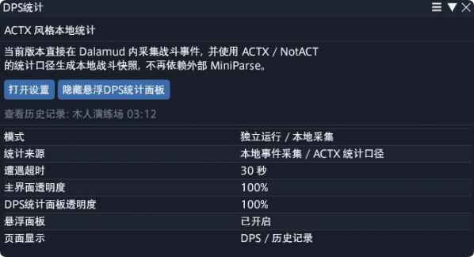
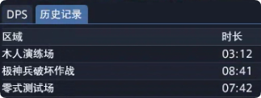

# DPS统计 使用说明

这份文档适合：

- 第一次使用插件的玩家
- 想快速知道每个按钮是做什么的人
- 不想看开发说明，只想知道怎么用的人

## 插件简介

`DPS统计` 是一个直接在游戏里显示战斗统计的插件。

当前版本的核心特点：

- 不需要另外打开外部统计网页或额外的小窗口。
- 直接在游戏里统计战斗数据。
- 可以看 `DPS`、`HPS`、承伤、历史记录等内容。
- 提供主界面、设置界面、悬浮统计面板和历史记录回看。

如果你只想知道“怎么用”，可以直接看下面的内容，不需要了解插件内部原理。

本文中的截图用于帮助你更快找到对应按钮和页面。

- 如果你的界面布局和截图略有不同，通常只是窗口位置不同
- 只要按钮名称和页签名称对得上，就可以照着使用

## 3分钟快速上手

如果你是第一次用，建议直接按下面步骤来：

先在 Dalamud 自定义仓库中添加这条库链：

`https://raw.githubusercontent.com/anmili2022/MyDalamudRepo/main/pluginmaster.json`

然后按下面步骤来：

1. 刷新仓库列表并安装 `DPS统计`。
2. 打开插件主窗口。
3. 点击 `打开悬浮DPS统计面板`。
4. 打开设置，把你不想看的页签先关掉。
5. 先保留 `DPS` 页，进入战斗后看面板是否正常出数。
6. 如果暂时没有战斗，可以点 `导入测试数据` 先看界面效果。
7. 如果字太小、太挤或太宽，再去设置里调列宽、行高和透明度。

如果你只想最简单地使用这个插件：

- 平时只开悬浮面板
- 主要看 `DPS`
- 需要时右键 `DPS` 页签打开设置

## 安装前准备

- 在 Dalamud 自定义仓库中添加 `https://raw.githubusercontent.com/anmili2022/MyDalamudRepo/main/pluginmaster.json`
- 刷新插件仓库列表后，搜索 `DPS统计`

## 打开方式

### 主窗口

- 启用插件后，可以在游戏里的插件入口中打开 `DPS统计` 主窗口。
- 主窗口主要用于查看插件状态，以及打开设置和悬浮统计面板。

截图看点：

- 主窗口主要用来确认插件是否正常工作
- 这里也可以直接打开设置和悬浮统计面板

### 设置窗口

可以通过以下任一方式打开设置：

- 游戏里的插件设置入口
- 主窗口中的 `打开设置`
- 悬浮面板 `DPS` 页签上右键

再次右键 `DPS` 页签时，会关闭设置窗口。

截图看点：

- 设置窗口里可以控制面板显示内容
- 也可以调整列宽、行高、透明度和颜色

## 第一次建议这样设置

第一次使用时，比较推荐下面这套简单设置：

- 在 `悬浮面板显示项目` 中只保留：
  - `DPS`
  - `历史记录`
- 在 `DPS 页面列显示` 中先保留：
  - `职业`
  - `伤害量`
  - `秒伤`
- 如果你不太关心倒地次数，可以先把 `死亡列` 关掉
- 如果面板里名字太挤：
  - 调大 `玩家列最小宽度`
- 如果你觉得每一行太薄、不好点：
  - 调大 `表格行高`
- 如果觉得悬浮窗太挡视线：
  - 降低 `DPS统计面板透明度`

这样设置之后，绝大多数情况下已经够用。

## 悬浮统计面板

### 打开与关闭

- 可在主窗口中点击 `打开悬浮DPS统计面板`
- 也可在设置窗口中勾选 `显示悬浮DPS统计面板`

### 页面

悬浮面板支持以下页签：

- `DPS`
  也就是每秒伤害
- `HPS`
  也就是每秒治疗
- `承伤`
  也就是受到伤害的情况
- `概览`
  也就是这场战斗的总体信息
- `历史记录`
  也就是之前打过的战斗记录

每个页签都可以在设置中单独显示或隐藏。

### DPS 页签交互

- 左键点击 `DPS` 页签：
  - 如果当前已经在 `DPS` 页，会折叠成只显示页签
  - 再点一次会恢复展开
- 当前折叠态尺寸固定为：
  - 宽度 `270`
  - 高度 `42`
- 右键点击 `DPS` 页签：
  - 打开 / 关闭设置窗口

截图看点：

- 平时最常用的就是这个面板
- 你可以直接看每个人的伤害量和秒伤
- 如果挡视线，可以去设置里调透明度

## 最常用的几个操作

### 只想看当前输出

- 打开悬浮面板
- 保留 `DPS` 页
- 进入战斗后直接看 `秒伤` 和 `伤害量`

### 想看整队表现

- 看表格底部的 `总DPS`
- 看每个人的 `伤害量`
- 看右边占比条，判断谁输出占比更高

### 想回看上一场战斗

- 切到 `历史记录`
- 点击你想看的那一条
- 再切回 `DPS` 或 `概览` 查看那场战斗的数据

### 想测试界面但现在没在打本

- 打开设置
- 点击 `导入测试数据`
- 去 `历史记录` 里切换不同测试记录看效果

## 统计范围

当前统计对象只包括：

- 你自己
- 当前队伍里的队友

补充说明：

- 队伍里的 NPC 队友也会被统计
- 召唤物、宠物造成的伤害会算到它们的主人头上
- 不在你当前队伍里的其他玩家，不会进入统计

## 数据显示说明

### DPS 页面

`DPS` 页面支持以下列按设置显示或隐藏：

- `职业`
- `伤害量`
- `秒伤`
- `死亡`

这些列可以简单理解为：

- `职业`
  看这个人玩的是什么职业
- `伤害量`
  看这场战斗一共打了多少伤害
- `秒伤`
  看平均每秒打了多少伤害
- `死亡`
  看这场战斗倒下了几次

其他说明：

- 表格最下方有一行 `总DPS`，用于显示全队合计结果
- 伤害量使用中文单位显示，例如：
  - `9.68万`
  - `1.25亿`
  - `2.00兆`

### HPS / 承伤 / 概览

- `HPS` 页显示秒疗
- `承伤` 页显示秒承伤
- `概览` 页显示遭遇级摘要和角色级明细

### 历史记录

- 历史记录会保存每场战斗的完整结果
- 每条历史记录会显示 `开始时间`、`结束时间` 和 `时长`
- 可以在 `历史记录` 页直接点击 `导出历史记录` / `导入历史记录`
- 在 `历史记录` 页中点击某条记录后：
  - 悬浮面板会切换到那场战斗的数据
  - `DPS / HPS / 承伤 / 概览` 会一起切换过去
- 当前选中的历史记录会高亮显示
- 新的实时战斗开始后，界面会自动切回实时数据

导入导出说明：

- 历史记录会导出到插件配置目录下的 `history-records.json`
- 点击 `导入历史记录` 会从同一个文件读回历史记录

截图看点：

- 如果你想回看刚刚那一把打得怎么样，就点这里
- 点开以后，面板会显示那一场战斗的记录
- 再打新的战斗时，会自动回到实时显示

## 设置项说明

### 窗口设置

- `主界面透明度`
- `DPS统计面板透明度`
- `显示悬浮DPS统计面板`

### 战斗结束设置

- `全队脱战（PartyList）即为战斗结束`
- `全队脱战，且延迟 X 秒为战斗结束`
- `X（秒）`

默认使用 `全队脱战（PartyList）即为战斗结束`。

简单理解：

- 如果你希望按队伍整体脱战来收尾，就用 `全队脱战（PartyList）`
- 如果你希望在全队脱战后额外等待一段时间再收尾，就用 `全队脱战，且延迟 X 秒为战斗结束`
- 如果你觉得战斗结束得太快，可以把这个值调大一点

### 悬浮面板显示项目

- 控制 `DPS / HPS / 承伤 / 概览 / 历史记录` 是否显示
- `玩家列最小宽度`
- `固定列宽`
- `表格行高`

说明：

- `玩家列最小宽度 = 0` 时使用自动宽度
- `表格行高 = 0` 时使用自动高度

简单理解：

- 如果名字显示太挤，可以调大 `玩家列最小宽度`
- 如果你想让每一行更高、更容易点中，可以调大 `表格行高`

### DPS 页面列显示

- `显示职业列`
- `显示伤害量列`
- `显示秒伤列`
- `显示死亡列`
- `显示人数`

简单理解：

- `显示人数` 是 `DPS` 页最多显示多少人
- 如果你只想看前几名，可以把人数调小
- 如果你想把整队都看出来，就把人数调大

### 占比条配色

支持两种模式：

- `主题色`
- `单色`

`主题色` 模式下，不同职业会使用各自的主题颜色。

### 主题色调色板

- 可以单独调整每个职业的占比条颜色
- 支持一键 `恢复默认主题色`

### 数据与状态

- `导入测试数据`
- `清空历史`
- `恢复默认`

说明：

- `导入测试数据` 适合在没有进战时先看看界面效果
- `清空历史` 会删除已经保存的历史战斗记录
- `恢复默认` 会把设置改回插件初始状态

## 测试数据

点击 `导入测试数据` 后：

- 会生成 3 条不同内容的历史测试记录
- 不会清空已有历史记录
- 如果相同的测试记录已经存在，会按历史记录标识覆盖更新

当前内置测试场景：

- `零式测试场`
- `极神兵破坏作战`
- `木人演练场`

截图看点：

- 如果你现在没有进战
- 又想先确认面板排版、颜色、列宽、历史记录是否正常
- 直接用测试数据最方便

## 已知限制

当前版本优先保证“能稳定使用”，所以还有一些功能仍在继续完善：

- 某些更复杂的持续伤害统计还在继续调整
- 某些更复杂的持续治疗统计还在继续调整
- 个别很细的战斗补算逻辑还没有完全补齐

如果你平时主要是看：

- 当前队伍的秒伤
- 伤害量
- 承伤
- 历史记录回看

那现在已经可以正常使用。

## 常见问题

### 1. 面板显示“等待战斗数据...”

说明插件当前还没有收到可用的战斗数据。

可先检查：

- 是否已经进战
- 是否开启了悬浮面板
- 是否把对应页签隐藏了

如果只是想检查界面，可以先使用 `导入测试数据`。

### 2. 为什么我看到的不是实时数据，而是旧记录

大多数情况下，是因为你刚刚点开了 `历史记录` 里的某一条。

这时面板会优先显示你点开的那场战斗。

解决方法：

- 直接重新进入下一场战斗
- 插件会自动切回实时数据

### 3. 为什么没有统计队伍外的人

这是当前版本的设计行为。

为了避免误统计，插件现在只统计：

- 自己
- 当前队伍里的队友

### 4. 导入测试数据会不会把我自己的历史记录清掉

不会。

现在点击 `导入测试数据` 时：

- 会保留你原来已有的历史记录
- 只会补进测试用的那几条记录
- 如果同一条测试记录已经存在，就更新那条，不会无限重复新增

## 截图说明

当前使用说明中的截图主要对应下面几个场景：

- `md/images/usage-main-window.png`
  对应主窗口
- `md/images/usage-settings-window.png`
  对应设置窗口
- `md/images/usage-floating-dps.png`
  对应悬浮面板的 `DPS` 页
- `md/images/usage-history-records.png`
  对应历史记录点击回看
- `md/images/usage-test-data.png`
  对应导入测试数据

如果你后面还要继续更新截图，建议保持：

- 字体清晰
- 不要截太大的空白区域
- 面板内容尽量完整
- 一张图只说明一个重点
